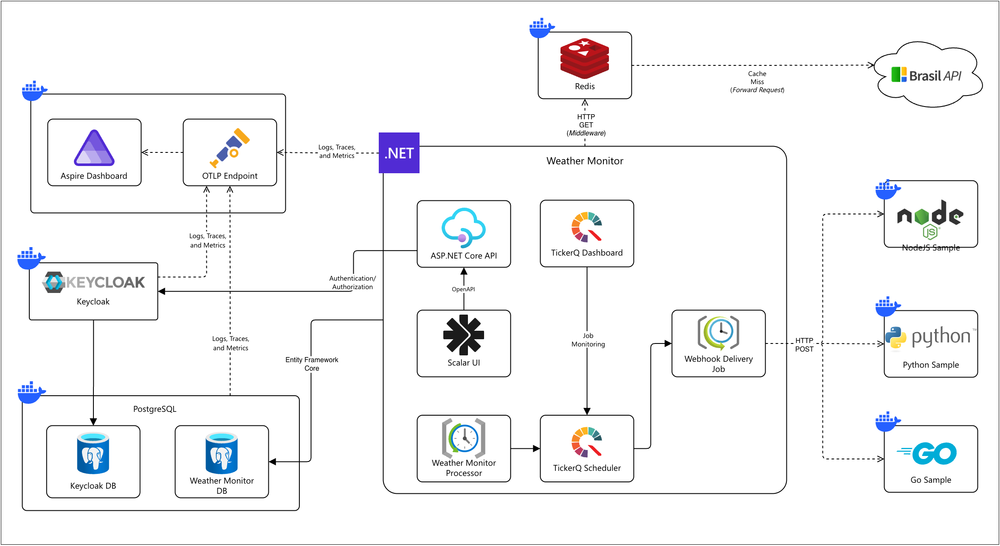
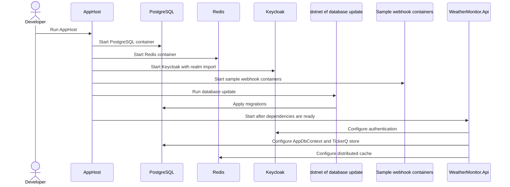
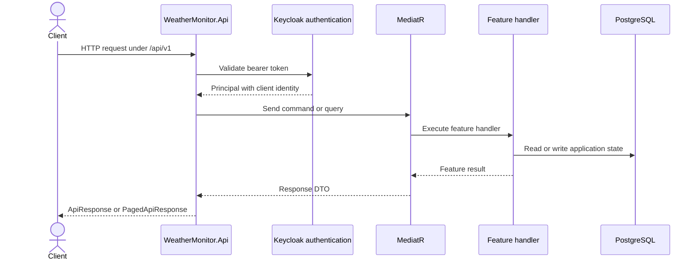
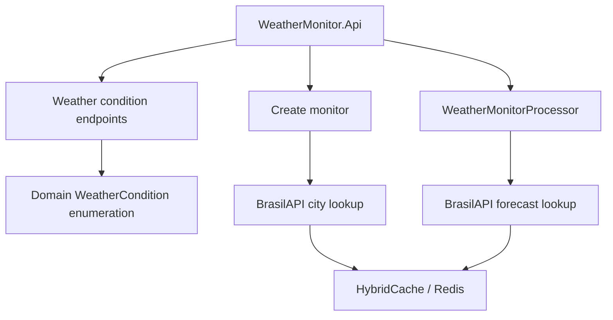

# Architecture

Weather Monitor is a .NET 10 API coordinated locally by Aspire. The API exposes versioned HTTP endpoints, uses Keycloak for authentication, stores monitor and delivery state in PostgreSQL, caches BrasilAPI GET responses through HybridCache backed by Redis, and uses TickerQ for scheduled monitor processing and webhook delivery.

The implementation follows Vertical Slice Architecture: each feature owns its endpoint, request, handler, validator, and response shape. Domain rules stay in `WeatherMonitor.Domain`; persistence, external clients, and orchestration stay at the application and infrastructure edges.

## Runtime Components

| Component                      | Responsibility                                                                                                                                          |
|--------------------------------|---------------------------------------------------------------------------------------------------------------------------------------------------------|
| Aspire Dashboard               | Local observability surface for resources, logs, traces, metrics, and links to service dashboards.                                                      |
| OTLP endpoint                  | Receives OpenTelemetry data from the application and infrastructure containers.                                                                         |
| Keycloak                       | Issues and validates access tokens used by protected API endpoints.                                                                                     |
| PostgreSQL                     | Hosts the Keycloak database, Weather Monitor database, TickerQ tables, monitor state, delivery state, and audit shadow properties.                      |
| Redis                          | Supports the HybridCache distributed layer for external BrasilAPI `GET` responses.                                                                      |
| BrasilAPI                      | Resolves city codes during monitor creation and returns weather forecasts during monitor processing.                                                    |
| ASP.NET Core API               | Exposes the versioned HTTP API, authentication integration, OpenAPI metadata, monitor workflows, persistence, caching, and background-job registration. |
| Scalar UI                      | Presents the OpenAPI contract and supports authenticated API calls during local development.                                                            |
| TickerQ Dashboard              | Shows scheduled and executed TickerQ jobs for local inspection.                                                                                         |
| TickerQ Scheduler              | Runs the recurring monitor processor and schedules time-based webhook delivery jobs.                                                                    |
| Weather Monitor Processor      | Groups enabled monitors by city code, fetches forecasts, matches configured weather conditions, and creates pending deliveries.                         |
| Webhook Delivery Job           | Sends matched weather events to configured webhook URLs and records delivery status.                                                                    |
| NodeJS, Python, and Go samples | Local receiver containers used to inspect webhook requests during development.                                                                          |

## Local Orchestration

The AppHost is the local entry point. It creates the infrastructure resources, runs the EF database update command after PostgreSQL is available, starts sample receiver containers, and starts `WeatherMonitor.Api` after its dependencies are ready.

## API Request Flow

Protected endpoints require an authenticated client. The API derives `ClientId` from `ClaimsPrincipal.Identity?.Name`; clients do not send ownership identifiers in route, query string, or request body.

## Integration Boundaries

BrasilAPI is used only for city lookup and weather forecast retrieval. Weather-condition code listing and lookup do not call BrasilAPI or the database; they read the domain enumeration in memory.

