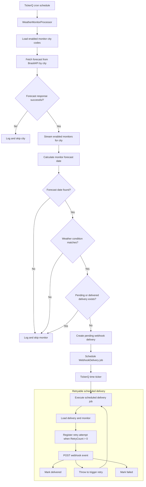
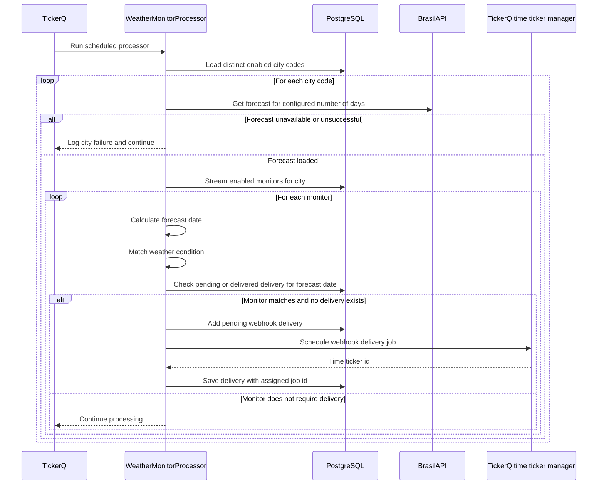
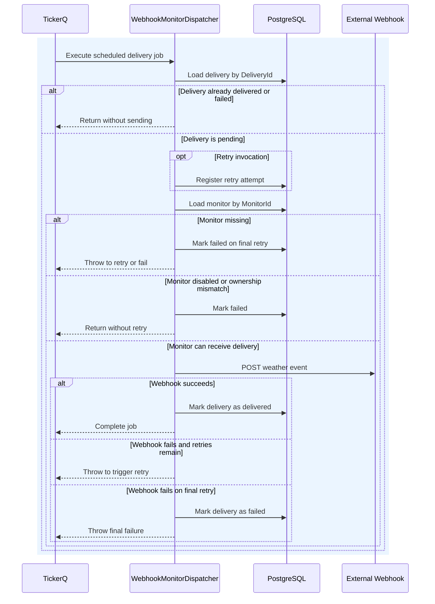

# Background Processing

Background processing is handled by TickerQ. One recurring job runs `WeatherMonitorProcessor`, which finds matching monitors and schedules `WebhookDelivery` jobs. Each scheduled delivery is executed by `WebhookMonitorDispatcher` through a TickerQ time ticker.

Webhook delivery retry behavior is currently hardcoded when the delivery job is created: `Retries = 2` and `RetryIntervals = [60, 60]`.

## End-to-End Flow

## Processor Execution

The processor groups work by city code. This avoids fetching the same forecast once per monitor during a processor execution. The BrasilAPI forecast endpoint is called once per enabled city code, then every enabled monitor in that city is matched against the returned forecast. External BrasilAPI `GET` calls also pass through the Redis-backed HybridCache layer, which can serve successful cached responses for repeated lookups.

## Delivery Dispatch And Retries

TickerQ invokes `WebhookMonitorDispatcher` when a scheduled `WebhookDelivery` job is due. The dispatcher validates that the delivery and monitor still exist, that the monitor is enabled, and that the delivery still matches the monitor owner. It then sends a JSON webhook event to the configured URL.

If the webhook call fails, the dispatcher throws so TickerQ can retry the job. When TickerQ invokes a retry attempt, the delivery retry count is registered before the webhook is sent again. On the final retry attempt, the delivery is marked as failed.

## Webhook Request Shape

The dispatcher sends a `POST` request to the monitor webhook URL. The request body is JSON and contains delivery, monitor, forecast, location, and weather-condition data. The dispatcher also adds delivery metadata headers:

- `X-WeatherMonitor-Delivery-Id`
- `X-WeatherMonitor-Monitor-Id`
- `X-WeatherMonitor-Event`
- `X-WeatherMonitor-Sent-At`
- `Idempotency-Key`

If the monitor has a stored access token, the dispatcher sends it as a bearer token in the `Authorization` header.
