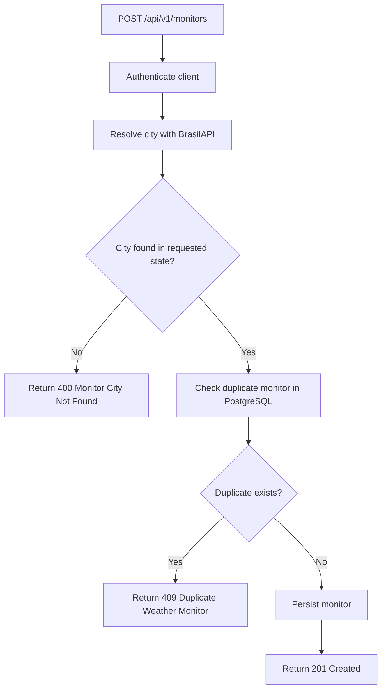
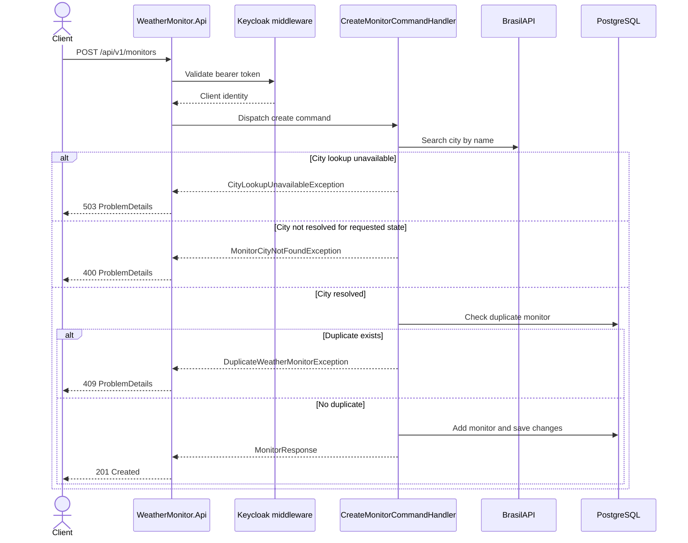
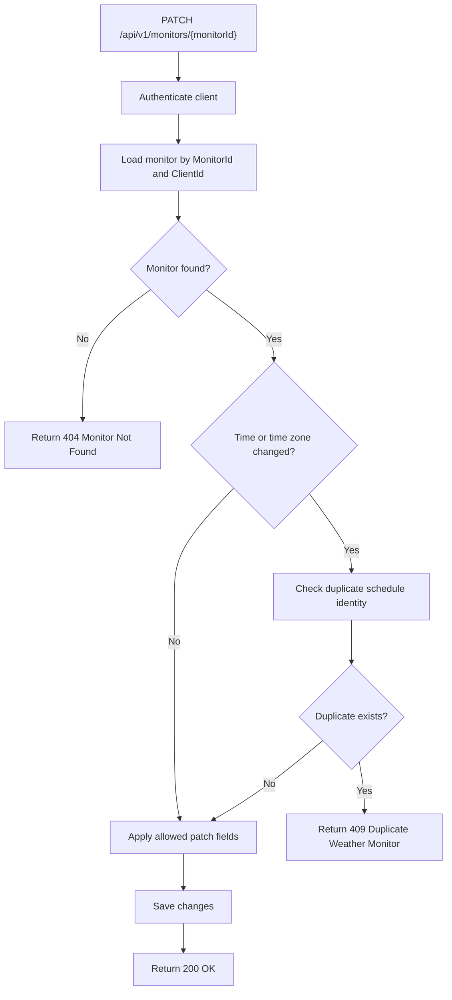
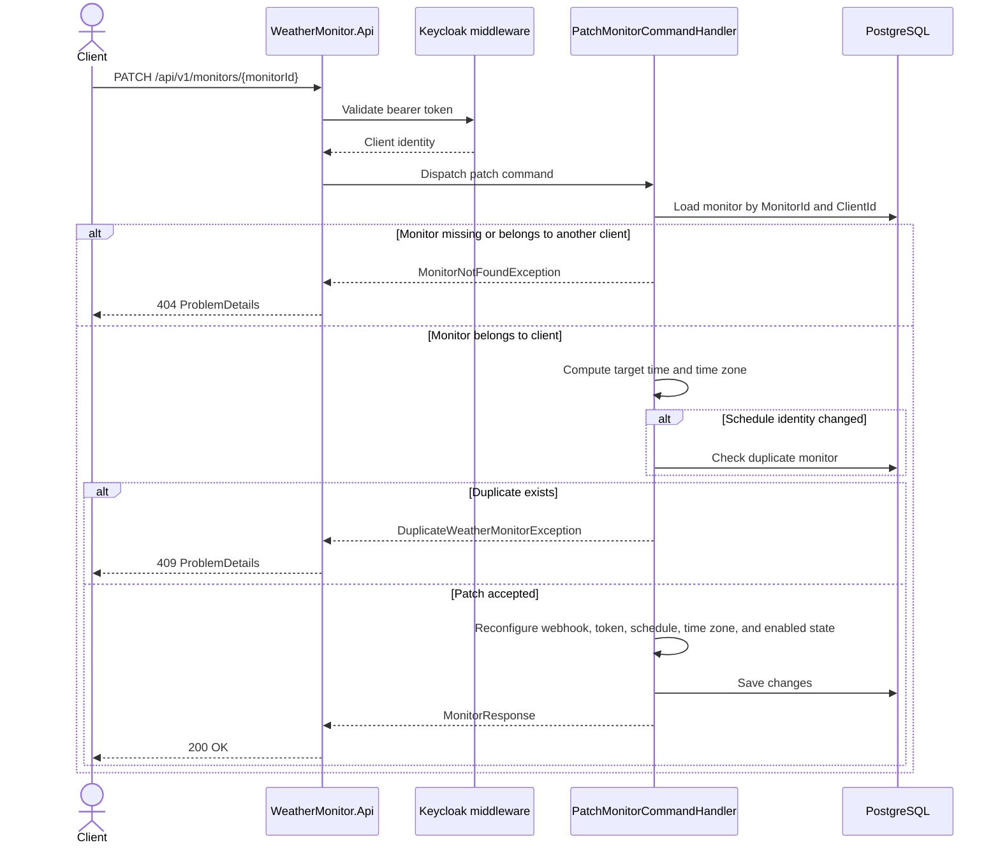
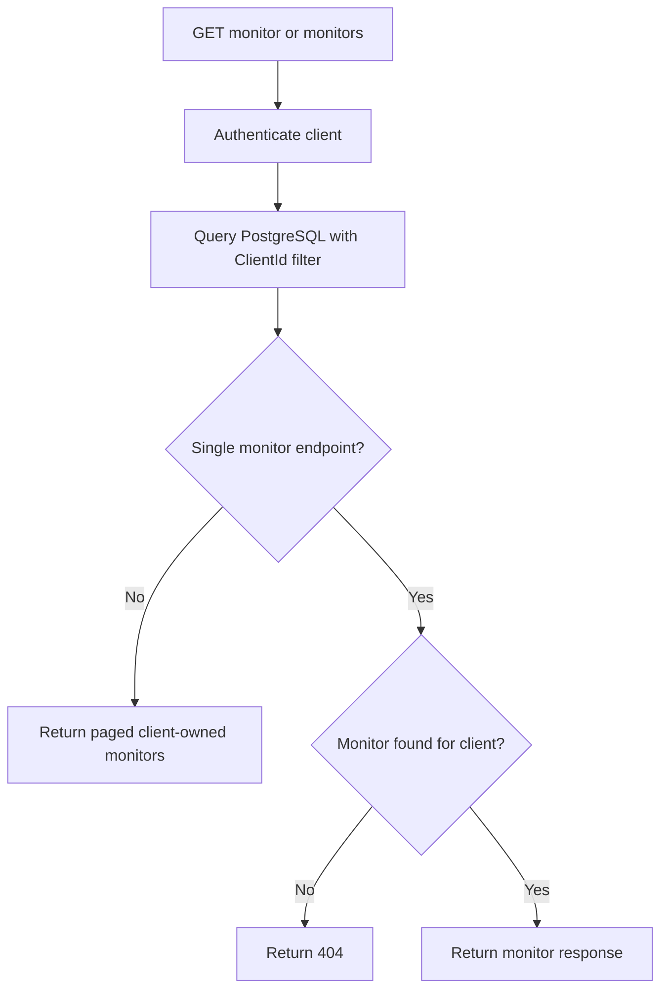

# Monitor Lifecycle

Monitors are owned by authenticated clients. The API always derives `ClientId` from the authenticated principal and never accepts it from route, query string, or request body. Cross-client monitor access is intentionally indistinguishable from a missing resource and returns `404`.

The canonical monitor response never includes the stored webhook access token.

## Create Monitor

Creating a monitor resolves the requested city through BrasilAPI, verifies that the resolved city belongs to the requested state, checks the duplicate rule, and persists the monitor.

A duplicate monitor has the same client, resolved city, scheduled local time, and time zone.

## Patch Monitor

Patch requests may change only the webhook URL, access token, scheduled time, time zone, and enabled state. `null` means "do not change this property"; `AccessToken = ""` clears the stored token. City and weather condition are immutable after creation.

The duplicate check only runs when the schedule identity changes. In this project, schedule identity is the scheduled local time plus time zone for the same client and resolved city.

## Read And List Monitors

Monitor reads always filter by `ClientId`. A monitor owned by another client is treated as not found and returns `404`. List endpoints return only the authenticated client's monitors.

